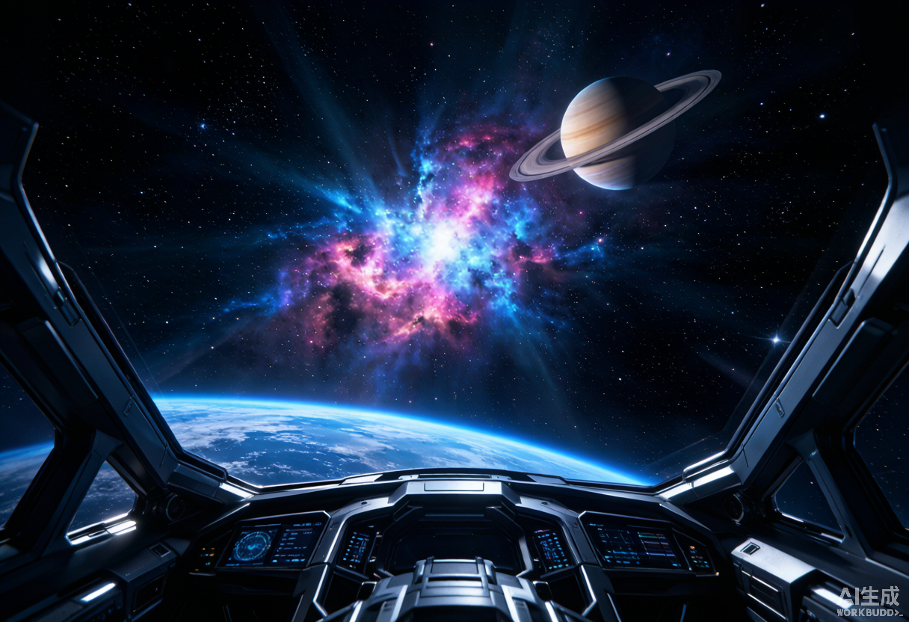

<p align="center">
  
</p>

<p align="center">
  <a href="https://github.com/WonderfulClaire/cosmic-voyage/stargazers"></a>
  <a href="https://github.com/WonderfulClaire/cosmic-voyage/network/members"></a>
  <a href="https://github.com/WonderfulClaire/cosmic-voyage/blob/main/LICENSE"></a>
  <a href="https://wonderfulclaire.github.io/cosmic-voyage/"></a>
  
  
</p>

<h1 align="center">🚀 COSMIC VOYAGE</h1>

<p align="center"><b>一场在浏览器里发生的电影级太空航行 —— 飞越真实宇宙、登陆星球、执行剧情任务。</b></p>
<p align="center"><i>A cinematic, browser-based space voyage: fly through the real cosmos, land on planets, and run story-driven missions — all in WebGL, zero install.</i></p>

<p align="center">
  <a href="https://wonderfulclaire.github.io/cosmic-voyage/"><b>▶ 在线试玩 Live Demo</b></a> · 无需安装，点开即飞
</p>

---

## 📑 目录 · Contents

- [这是什么 · What is it](#这是什么--what-is-it)
- [✨ 特性 · Features](#✨-特性--features)
- [🎮 玩法 · How to play](#🎮-玩法--how-to-play)
- [🌌 宇宙地图 · The Cosmos](#🌌-宇宙地图--the-cosmos)
- [🪐 任务线 · Missions](#🪐-任务线--missions)
- [⌨️ 操作 · Controls](#⌨️-操作--controls)
- [▶️ 运行 · Run](#▶️-运行--run)
- [🛠️ 技术栈 · Tech Stack](#🛠️-技术栈--tech-stack)
- [📁 项目结构 · Structure](#📁-项目结构--structure)
- [🗺️ 路线规划 · Roadmap](#🗺️-路线规划--roadmap)
- [🤝 贡献 · Contributing](#🤝-贡献--contributing)
- [❤️ 致谢 · Acknowledgements](#❤️-致谢--acknowledgements)
- [📄 许可证 · License](#📄-许可证--license)

---

## 这是什么 · What is it

**Cosmic Voyage** 是一个纯前端、零后端的沉浸式太空 Web 应用。你在地球轨道醒来，可以：

- 🛰 **自由飞行** —— 六自由度驾驶飞船穿梭于行星、黑洞、星云与星系之间，靠近任意天体按 `E` 弹出真实科普卡片；
- 🎬 **看开场电影** —— 游戏开始前一段「人类从未停止探索太空」的宇宙总览；
- 🪐 **登陆星球** —— 火星巡视、月球 1/6g 跳跃、气态巨行星云顶漂浮、金星地狱模式；
- 🚀 **执行任务线** —— 3 条剧情分支任务，点火升空、着陆、解锁地标、拍明信片、结算致谢。

无需服务器、无需联网（Three.js 已内置 + Service Worker 离线），一个网页直接跑。

---

## ✨ 特性 · Features

- 🎥 **开场电影 + 宇宙总览** —— 进入前一段沉浸式宣传片，带你看遍经典星宿与探索史。
- 🕹️ **六自由度飞船操控** —— `WASD` 平移、鼠标转视角、`Shift` 加速，无重力束缚的自由飞行。
- 🪐 **登陆与地表探索** —— 真实地表：地球大陆/海洋、火星奥林匹斯山与水手谷、月球静海、气态巨行星云顶漂浮、金星 460℃ 硫酸云地狱模式；低重力下可跳跃。
- 🚀 **3 条剧情任务线** —— 火星方舟（殖民）/ 深海回响（地外生命）/ 曙光计划（月球中转站），含真实数据与里程碑台词。
- 📸 **明信片拍照 + 分享** —— 按 `P` 把当前画面合成品牌明信片，支持系统分享 / 下载收藏。
- 🔊 **程序化科学音效** —— 火箭轰鸣、引擎环境音、科普配乐，全部 Web Audio 实时合成。
- 📖 **边飞边长知识** —— 靠近天体自动提示，按 `E` 弹出真实、有出处的天文科普卡（一句话速记 + 多条知识点）。
- 🧭 **游戏化 HUD** —— 右下角星图雷达 + 屏幕边缘发光方向箭头，像 MOBA 小地图一样指路。
- 🗺️ **星图航图 (`G`) / 宇宙图鉴 (`B`)** —— 一键跃迁到 8 大宇宙区域；按区域与类型统计探索进度。
- 🌌 **50+ 真实天体 · 8 大区域** —— 从太阳系到可观测宇宙边缘，含「人类探索」与「中华问天」专题。
- 🎨 **全程序化视觉** —— 星空粒子、发光星云、土星环、黑洞吸积盘、辉光后处理，**无任何外部素材**。
- 📦 **零后端纯静态 + 离线可用** —— 部署简单，刷新一次后即可断网游玩。

---

## 🎮 玩法 · How to play

| 模式 | 入口 | 体验 |
|------|------|------|
| **自由漫游** | 主菜单「启动引擎」 | 六自由度飞行，看宇宙、按 `E` 学天文、按 `G` 跃迁 |
| **剧情任务** | 主菜单「选择远征」 | 选任务线 → 点火升空 → 登陆地表 → 解锁地标 → 拍明信片 → 结算 |
| **宇宙总览** | 开场自动播放 | 一段电影级宣传片，认识经典星宿与探索史 |

---

## 🌌 宇宙地图 · The Cosmos

应用内含 **50+ 真实天体**，按 8 大区域组织（打开星图航图 `G` 可一键跃迁）：

- ☀️ **太阳系** —— 行星 / 卫星 / 矮行星 / 小行星带 / 彗星
- 🛰 **近邻恒星系** —— 比邻星 b、TRAPPIST-1e、开普勒-452b、热木星、红矮星
- 🌌 **星云与遗迹** —— 猎户座、蟹状、创生之柱、玫瑰、螺旋、SN 1987A、红/白矮星
- 🕳 **致密与极端** —— 黑洞、脉冲星、双中子星、磁星
- 🌀 **银河系** —— 人马座 A*、球状/疏散星团、麦哲伦云
- 🌠 **宇宙深处** —— 仙女座、三角座、草帽星系、类星体、宇宙微波背景
- 🚀 **人类探索** —— 天和核心舱、嫦娥五号、玉兔二号、祝融号、旅行者 1 号、JWST、哈勃
- 📜 **中华问天** —— 圭表、浑仪、简仪、登封观星台、二十四节气

每个天体都有一张真实、有出处的科普卡，靠近即学。

---

## 🪐 任务线 · Missions

> 选择一条远征，体验带剧情的太空旅程（数据均来自真实航天计划）：

- 🟠 **火星方舟 (Mars Ark)** —— 公元 2049，第一批人类移民火星。7 个月航程、约 1.6 亿公里、登陆奥林匹斯山与水手谷。
- 🟣 **深海回响 (Deep Sea Echo)** —— 飞向疑似存在地外生命的星球，确认生命信号。
- 🟢 **曙光计划 (Dawn)** —— 公元 2046，月球中转站。在 1/6g 的静海跳跃，遥望地球升起。

每条任务都有专属里程碑台词与结尾致谢，并可拍下专属明信片留念。

---

## ⌨️ 操作 · Controls

| 按键 | 功能 · Function |
|------|-----------------|
| `W` / `S` | 前进 / 后退 · Forward / Backward |
| `A` / `D` | 左移 / 右移 · Strafe left / right |
| `Space` / `C` | 上升 / 下降 · Ascend / Descend |
| 鼠标 | 转动视角（先点击画面锁定指针）· Look (click to lock) |
| `Shift` | 引擎加速 · Engine boost |
| `E` | 靠近天体时查看科普卡片 · Astronomy card |
| `G` | 打开星图航图，跃迁到区域 · Star-chart warp |
| `B` | 打开宇宙图鉴（探索进度）· Universe Codex |
| `P` | 拍明信片 · Take postcard |
| `R` | 返航 / 结束任务 · Return / end mission |
| `X` | 离开地表（漫游模式）· Exit surface |
| `H` | 开关操作帮助 · Toggle help |
| `ESC` | 解除鼠标锁定 · Release pointer lock |

---

## ▶️ 运行 · Run

### 🌐 在线玩
直接打开 **[Live Demo](https://wonderfulclaire.github.io/cosmic-voyage/)**，无需安装。

### 💻 本地运行
项目使用 ES Modules + importmap，需通过本地 HTTP 服务器打开（不要直接双击 `file://`）：

```bash
cd cosmic-voyage
python3 -m http.server 8000
# 浏览器访问 http://localhost:8000
```

Three.js 已内置在 `vendor/`，并配合 Service Worker 离线缓存，**首次加载后断网也能玩**。

---

## 🛠️ 技术栈 · Tech Stack

- [Three.js](https://threejs.org/) r160（**本地内置** `vendor/three`，非 CDN）
- `EffectComposer` + `UnrealBloomPass` —— 辉光后处理
- `PointerLockControls` —— 第一人称视角
- Web Audio API —— 实时合成火箭轰鸣 / 环境音 / 配乐
- Canvas 2D 程序化纹理 / 几何 / GLSL 着色器（黑洞吸积盘）
- Service Worker —— 离线缓存（stale-while-revalidate）

---

## 📁 项目结构 · Structure

```
cosmic-voyage/
├── assets/          # README 横幅与场景截图
├── index.html       # 页面骨架 + HUD / 卡片 DOM + importmap
├── styles.css       # 座舱 HUD / 科普卡 / 任务线样式
├── main.js          # 场景、飞船操控、天体、登陆、任务线、明信片
├── audio.js         # Web Audio 程序化音效
├── knowledge.js     # 宇宙地点与天文数据（改这里就能加星球）
├── vendor/three/    # 本地内置的 Three.js
├── sw.js            # Service Worker 离线缓存
├── README.md
└── LICENSE
```

> 想加自己的世界？编辑 [`knowledge.js`](knowledge.js) 里的地点数组，填名字、坐标、颜色与知识点即可。

---

## 🗺️ 路线规划 · Roadmap

- [x] 开场电影 + 宇宙总览
- [x] 登陆地表（地球 / 火星 / 月球 / 云顶 / 金星）
- [x] 3 条剧情任务线
- [x] 明信片拍照与分享
- [x] 程序化科学音效 + Service Worker 离线
- [ ] 中英 UI 切换
- [ ] 移动端 / 手柄支持
- [ ] 问答模式 —— 飞行中测验你学到的知识
- [ ] 物理展品（傅科摆、陨石坑）作为可交互地标

---

## 🤝 贡献 · Contributing

欢迎 PR 与创意！无论是新增天体、修 bug，还是更酷的着色器 —— 开 issue 或 PR 即可。让我们一起把太空探索变得更有趣。🚀

---

## ❤️ 致谢 · Acknowledgements

因对太空的好奇与学习的快乐而做，基于 [Three.js](https://threejs.org/) 构建。

---

## 📄 许可证 · License

[MIT](LICENSE) © WonderfulClaire
