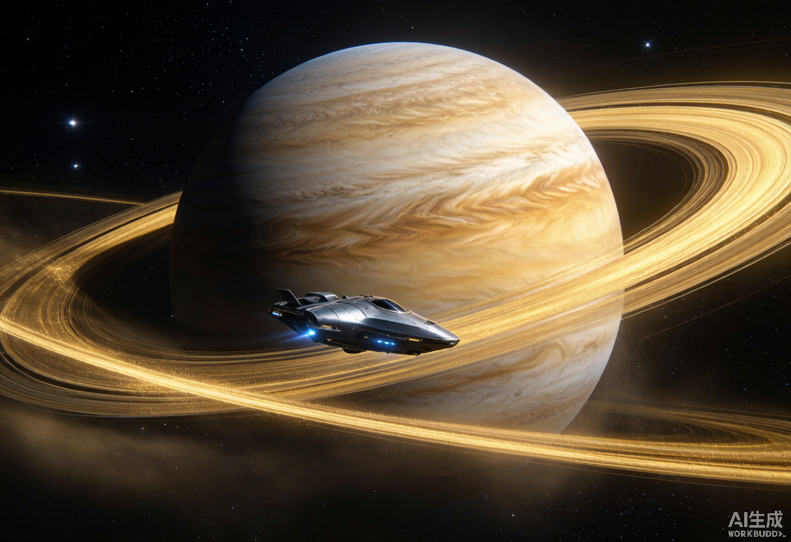
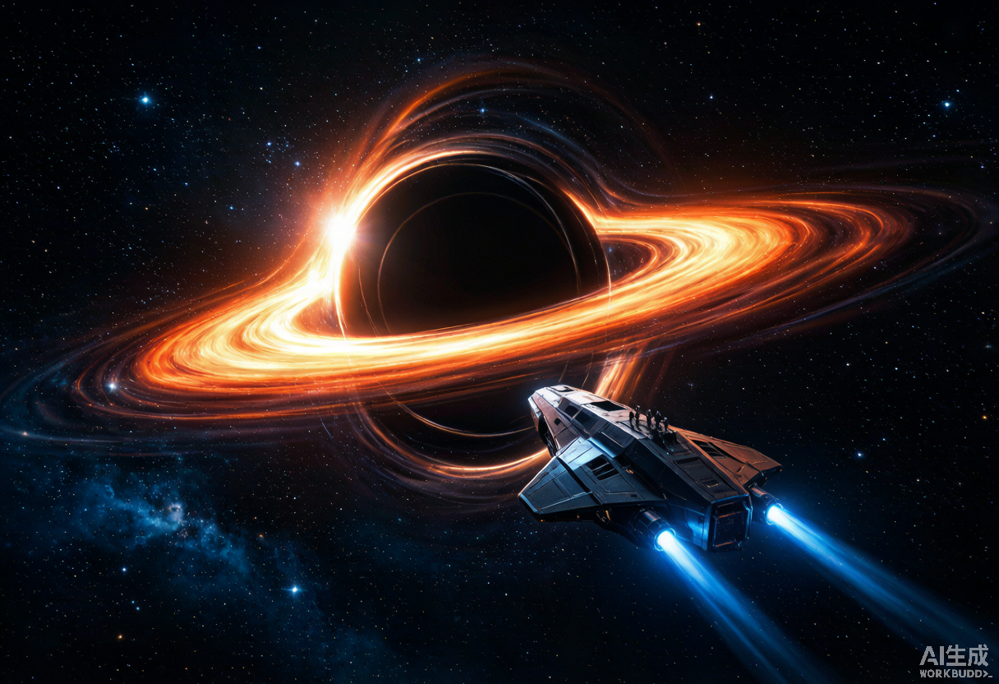

<p align="center">
  
</p>

<p align="center">
  <a href="https://img.shields.io/github/stars/WonderfulClaire/cosmic-voyage?style=for-the-badge"></a>
  <a href="https://img.shields.io/github/forks/WonderfulClaire/cosmic-voyage?style=for-the-badge"></a>
  <a href="https://github.com/WonderfulClaire/cosmic-voyage/blob/main/LICENSE"></a>
  <a href="https://wonderfulclaire.github.io/cosmic-voyage/"></a>
  
</p>

<h1 align="center">🚀 COSMIC VOYAGE</h1>
<p align="center"><b>沉浸式宇宙旅行 · 自由开飞船 + 交互式宇宙科普</b></p>
<p align="center">
  <i>An immersive web-based space travel experience — pilot a spaceship freely through the cosmos and learn real astronomy as you fly.</i>
</p>

---

> **EN** A browser-based, zero-backend immersive space simulator built with Three.js. You wake up in orbit, pilot a spaceship with full 6-DOF freedom, roam among planets, black holes, nebulae and galaxies, and press **`E`** when near any celestial body to pop up a real, sourced astronomy card.
>
> **中文** 一个纯前端、零后端的沉浸式宇宙旅行 Web 应用。你在地球轨道醒来，驾驶飞船自由穿梭于行星、黑洞、星云与星系之间，**靠近任意天体按 `E` 即可弹出真实科普卡片**，边飞边长知识。

🌌 **[▶ 在线体验 Live Demo](https://wonderfulclaire.github.io/cosmic-voyage/)** — 无需安装，点开即玩。

---

## ✨ Features · 特性

- 🕹️ **First-person spaceship piloting** — `WASD` translate, mouse look, `Shift` engine boost. Full 6-DOF free flight, no gravity constraints.
   **第一人称飞船操控**：WASD 平移、鼠标转视角、Shift 加速，六自由度自由飞行，无重力束缚。
- 🪐 **The whole universe, 8 zones × 53 real bodies** — from the Solar System all the way to the edge of the observable universe: planets, moons, dwarf planets, the Sun, asteroids & comets, plus a **meteorite collection**; nearby exoplanet systems (Proxima b, TRAPPIST-1e, Kepler-452b, hot Jupiters, red dwarfs); nebulae & stellar remnants (Orion, Crab, Eagle/Pillars of Creation, Rosette, Helix, SN 1987A, red giants, white dwarfs); compact extremes (black hole, pulsar, neutron-star binary, magnetar); the Galaxy (Sgr A\*, globular & open clusters, Magellanic Clouds); the deep universe (Andromeda, Triangulum, Sombrero, a quasar, and the Cosmic Microwave Background); **Human Exploration** (Tianhe core module, Chang'e 5, Yutu-2, Zhurong, Voyager 1, JWST, Hubble); and **Chinese Astronomy** (gnomon, armillary sphere, simplified instrument, Dengfeng observatory, 24 solar terms).
   **整个宇宙 · 8 大区域 × 53 个真实天体**：从太阳系一路延伸到可观测宇宙边缘——行星 / 卫星 / 矮行星 / 太阳 / 小行星带 / 彗星 / 陨石藏品；近邻系外星系（比邻星 b、TRAPPIST-1e、开普勒-452b、热木星、红矮星）；星云与恒星遗迹（猎户座、蟹状、创生之柱、玫瑰、螺旋、SN 1987A、红巨星、白矮星）；致密与极端（黑洞、脉冲星、双中子星、磁星）；银河系（人马座 A\*、球状/疏散星团、麦哲伦云）；宇宙深处（仙女座、三角座、草帽星系、类星体、宇宙微波背景）；**征程·人类探索**（天和核心舱、嫦娥五号、玉兔二号、祝融号、旅行者1号、韦伯、哈勃）；**中华问天**（圭表、浑仪、简仪、登封观星台、二十四节气）。
- 📖 **Learn-by-flying** — fly close to a body and a prompt appears; press `E` for a Chinese astronomy card (one-line memory hook + multiple facts).
   **靠近即学**：飞近天体自动提示，按 `E` 弹出中文科普卡片（含一句话速记 + 多条知识点）。
- 🎨 **Fully procedural visuals** — starfield particles, glowing nebulae, Saturn's rings, black-hole accretion disk, pulsar beams, and Bloom post-processing. **No external assets required.**
   **程序化视觉**：星空粒子、发光星云、土星环、黑洞吸积盘、脉冲星光束、辉光后处理——全部代码生成，无需任何外部素材。
- 📦 **Zero backend, pure static** — a single webpage runs anywhere; trivial to deploy on GitHub Pages.
   **零后端纯静态**：一个网页直接跑，轻松部署到 GitHub Pages。
- 🧭 **Game-style HUD** — a bottom-right **star-map radar** (north-up, player-centered) shows every destination's bearing & type; off-screen bodies get glowing **edge arrows** at the screen border pointing the way, with name + distance. Like a MOBA minimap.
   **游戏化 HUD**：右下角**星图雷达**（上北下南、玩家居中）显示每个地点的方位与类型配色；屏幕外的天体会在边缘弹出发光**方向箭头**并标注名字与距离，像 MOBA 小地图一样指路。
- 🚀 **Launch & return ceremony** — press **「启动引擎」** for a `3-2-1-🔥点火` countdown with screen shake, warp-speed lines and a camera FOV stretch; press `R` (or ESC → 返航) to decelerate and get a **mission debrief**: flight time, destinations explored, distance travelled, and your footprints.
   **发射 / 返航仪式感**：点「启动引擎」触发 3-2-1-🔥点火 全屏倒计时（屏幕震动 + 曲速隧道 + 相机拉伸 + 起步冲刺）；飞行中按 `R`（或 ESC → 返航）减速收尾，弹出**任务结算**：飞行时长 / 探索地点数 / 飞行距离 / 探索足迹。
- 🗺️ **Star-chart warp (G)** — open the **星图航图** to see all 8 cosmic zones and **warp** your ship to any zone's observation point in one click. Each arrival shows a zone-entry banner.
   **星图航图（按 `G`）**：打开**星图航图**纵览八大宇宙区域，一键**跃迁**到任意区域的观察点，抵达时有「进入区域」横幅。
- 📖 **Universe Codex (B)** — open the **宇宙图鉴** to track your exploration progress by zone and by object type (e.g. how many galaxies / nebulae you've visited).
   **宇宙图鉴（按 `B`）**：打开**宇宙图鉴**，按区域与天体类型统计你的探索进度（已访 / 总数）。

---

## 🖼️ Gallery · 画面

<p align="center">
  
  
</p>

<p align="center"><i>Concept art — the in-app scenes are rendered live in WebGL.</i></p>

---

## 🎮 Controls · 操作

| Key | Function · 功能 |
|-----|-----------------|
| `W` / `S` | Forward / Backward · 前进 / 后退 |
| `A` / `D` | Strafe left / right · 左移 / 右移 |
| `Space` / `C` | Ascend / Descend · 上升 / 下降 |
| `Mouse` | Look around (click to lock pointer) · 转动视角（先点击画面锁定指针） |
| `Shift` | Engine boost · 引擎加速 |
| `E` | Open astronomy card when near a body · 靠近天体时查看科普卡片 |
| `G` | Open star-chart, warp to a zone · 打开星图航图，跃迁到区域 |
| `B` | Open Universe Codex (progress) · 打开宇宙图鉴（探索进度） |
| `H` | Toggle help overlay · 开关操作帮助 |
| `ESC` | Release mouse lock · 解除鼠标锁定 |

---

## ▶️ Run · 运行

### 🌐 Online · 在线玩
Just open the **[Live Demo](https://wonderfulclaire.github.io/cosmic-voyage/)** — no install needed.

### 💻 Local · 本地运行
Because it uses ES Modules + importmap, serve it over a local HTTP server (don't open `file://` directly):

```bash
cd cosmic-voyage
python3 -m http.server 8000
# then visit http://localhost:8000
```

Three.js is loaded via CDN (jsDelivr), so the first run needs internet.

---

## 🪐 Destinations · 宇宙地点一览

The universe is organised into **8 cosmic zones** — open the star-chart (`G`) to warp between them. Every body below has a real, sourced astronomy card (press `E` when nearby).

### ☀️ 太阳系 · Solar System
地球 · 月球 · 水星 · 金星 · 火星 · 木星 · 土星（环）· 天王星 · 海王星 · 冥王星（矮行星）· 谷神星（矮行星）· 小行星带 · 哈雷彗星 · 陨石藏品

### 🛰 近邻恒星系 · Nearby Stars
比邻星 b · TRAPPIST-1e · 开普勒-452b · 51 Pegasi b（热木星）· 巴纳德星（红矮星）

### 🌌 星云与遗迹 · Nebulae & Remnants
猎户座大星云 · 蟹状星云 · 鹰状星云（创生之柱）· 玫瑰星云 · 螺旋星云 · 参宿四（红巨星）· 天狼星 B（白矮星）· SN 1987A

### 🕳 致密与极端 · Compact & Extreme
黑洞 · 脉冲星 · 双中子星 · 磁星

### 🌀 银河系 · The Galaxy
人马座 A\*（银心黑洞）· 球状星团 M13 · 大麦哲伦云 · 昴星团

### 🌠 宇宙深处 · Deep Universe
仙女座星系 · 三角座星系 · 草帽星系 · 类星体 3C 273 · 宇宙微波背景

### 🚀 征程·人类探索 · Human Exploration
天和核心舱 · 嫦娥五号 · 玉兔二号 · 祝融号 · 旅行者1号 · 韦伯太空望远镜 · 哈勃太空望远镜

### 📜 中华问天 · Chinese Astronomy
圭表 · 浑仪 · 简仪 · 登封观星台 · 二十四节气

> Want your own world? Edit the `LOCATIONS` array in [`knowledge.js`](knowledge.js) — add a name, position, color, and facts. That's it.

---

## 🛠️ Tech Stack · 技术栈

- [Three.js](https://threejs.org/) r160 (via CDN importmap)
- `EffectComposer` + `UnrealBloomPass` — bloom post-processing
- `PointerLockControls` — first-person camera
- Procedural textures (Canvas 2D) / geometry / GLSL shaders (black-hole disk)

---

## 📁 Structure · 项目结构

```
cosmic-voyage/
├── assets/         # README banner & concept art
├── index.html      # page skeleton + HUD / card DOM + importmap
├── styles.css      # cockpit HUD / astronomy-card styles
├── main.js         # scene, ship controls, celestial bodies, interaction
├── knowledge.js    # cosmic locations & astronomy data (edit to add worlds)
├── README.md
└── LICENSE
```

---

## 🗺️ Roadmap · 路线规划

- [x] More destinations — added **Human Exploration** (spacecraft) & **Chinese Astronomy** zones (53 bodies total)
- [ ] Localized UI (English / 中文 switch)
- [ ] Ambient space audio & engine sound
- [ ] Save / share flight paths
- [ ] Mobile & gamepad support
- [ ] Quiz mode — test what you learned while flying
- [ ] Physical exhibits (Foucault pendulum, meteorite crater) as interactive landmarks

---

## 🤝 Contributing · 贡献

PRs and ideas are welcome! Whether it's a new celestial body, a bug fix, or a cooler shader — open an issue or a pull request. Let's make space more fun to explore. 🚀

---

## ❤️ Acknowledgements

Made with curiosity for space and the joy of learning. Built with [Three.js](https://threejs.org/).

---

## 📄 License · 许可证

[MIT](LICENSE) © WonderfulClaire
